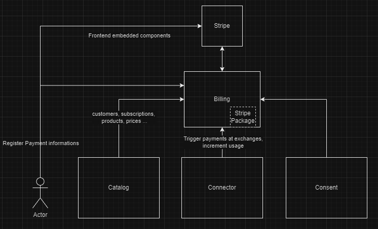
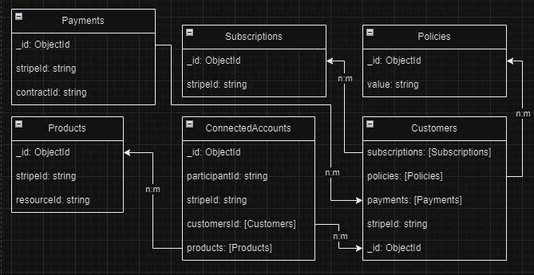
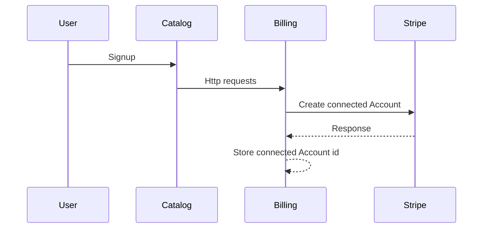
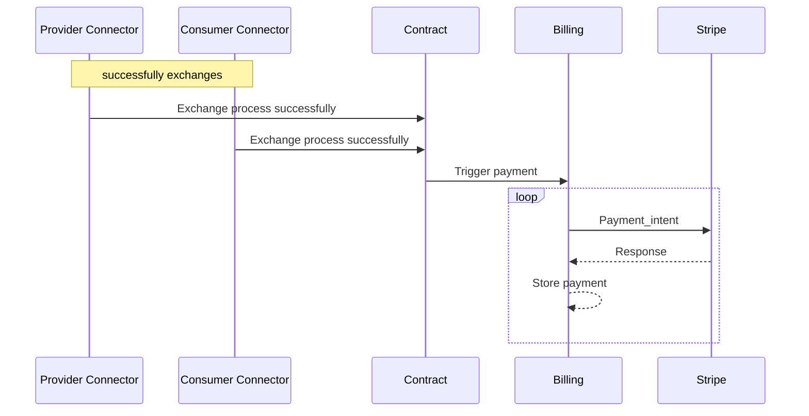
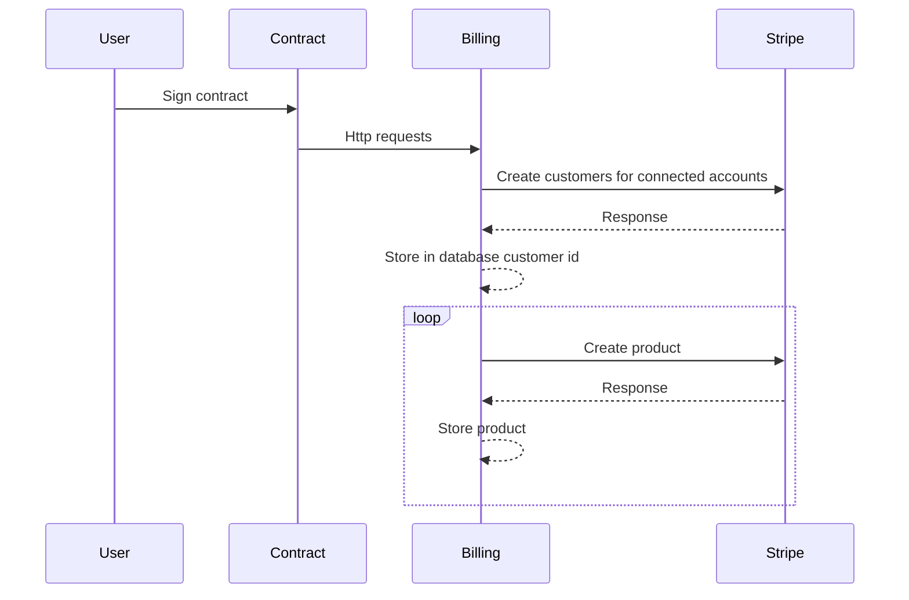
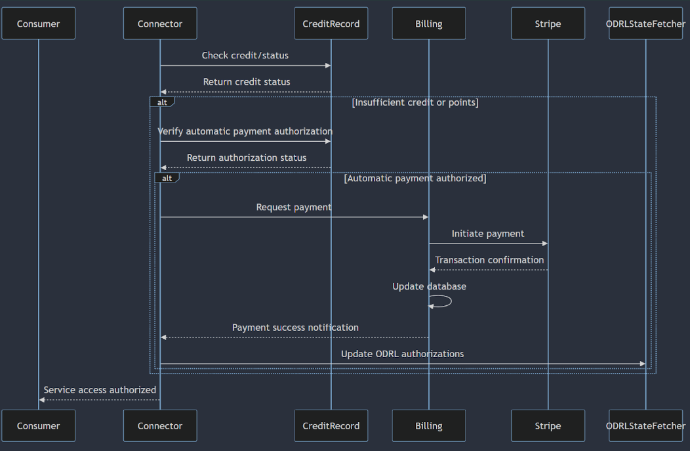

# Billing Design Document
The Billing of Prometheus-X uses Stripe and Stripe Connect to provide a strong solution for B2B payment through third-party accounts.
## Technical Usage Scenarios & Features
### Features/main functionalities
* Transparency and Trust
* Customizability and Flexibility
* Reduced Entry Barriers
* Innovation and Rapid Evolution
* Interoperability
* Shared Responsibility
* Cost-Effectiveness
* Ecosystem-wide Standards
* Promotes a Culture of Giving Back
* Simplified integration 
### Technical usage scenarios
* Allow individuals to view all transactions on their account and gain a clear understanding of the payment process.
* Enable individuals to provide and customize invoices
* Facilitate the integration of a payment platform
* Reduce costs for the BB instantiator.
* Offer comprehensive documentation.

### Requirements
* MUST ensure all transactions are logged and auditable.
* SHOULD allow customization for diverse data spaces and participant requirements.
* SHOULD eliminate the need for hefty licensing fees.
* MUST ensure the billing component adapts quickly to industry changes.
* SHOULD enable seamless interactions between different entities in the ecosystem.
* MUST combine robust security measures with user-managed customizations.
* SHOULD allow businesses to manage costs efficiently.
* SHOULD help establish industry-wide billing standards.
* MUST encourage collaborative problem-solving and innovation.
* MUST facilitate easy integration with user-friendly APIs and comprehensive documentation.
* MUST read the contract and trigger the right payment with the right prices
### Benefits
* Stripe and Stripe Connect provide detailed transaction logs and dashboards, ensuring transparency in the billing process.
* Stripe’s extensive APIs and webhooks allow businesses to tailor the payment experience to their specific needs, catering to diverse data spaces and participant requirements.
* Stripe’s accessible pricing model eliminates the need for hefty licensing fees, making it easier for new participants to join the ecosystem and fostering growth and diversity.
* The active development and community feedback loop at Stripe ensures that the billing component remains cutting-edge and adapts quickly to industry changes.
* Stripe Connect allows for easy integration with multiple platforms and services, ensuring seamless interactions between different entities in the ecosystem.
* Stripe’s robust security measures and compliance standards, combined with user-managed customizations, ensure a reliable and secure billing system.
* The scalable pricing model of Stripe allows businesses to manage costs efficiently, directing resources to other critical areas like R&D or user acquisition.
* Using Stripe can help establish industry-wide standards for billing, simplifying transactions and reducing disputes.
* Stripe’s community support and resources encourage collaborative problem-solving and innovation, benefiting the broader ecosystem.
* Stripe’s user-friendly API and comprehensive documentation facilitate easy integration, enabling organizations using Prometheus-X components to quickly add billing for their clients.
## Integrations
### Direct Integrations with Other BBs
* Consent
* Contract
* Catalog
* Connector
### Frontend Integration
Stripe provide easy to use [embedded components](https://docs.stripe.com/connect/supported-embedded-components).
## Relevant Standards
[PCI DSS version 4.0](https://east.pcisecuritystandards.org/document_library?category=pcidss&document=pci_dss) - see [Stripe guide](https://stripe.com/ie/guides/pci-compliance)
## Input / Output Data
### Connected Accounts creation on participant Signup example
#### Input
```json
{
  "firstName": "Doe",
  "lastName": "John",
  "email": "john@doe.com",
  "organizationName": "John Doe Organisation",
  "createdOnInstance": "VisionsTrust"
}
```
#### Output
```json
{
  "id": "acct_1Nv0FGQ9RKHgCVdK",
  "object": "account",
  "business_profile": {
    "annual_revenue": null,
    "estimated_worker_count": null,
    "mcc": null,
    "name": null,
    "product_description": null,
    "support_address": null,
    "support_email": null,
    "support_phone": null,
    "support_url": null,
    "url": null
  },
  "business_type": null,
  "capabilities": {},
  "charges_enabled": false,
  "controller": {
    "fees": {
      "payer": "application"
    },
    "is_controller": true,
    "losses": {
      "payments": "application"
    },
    "requirement_collection": "stripe",
    "stripe_dashboard": {
      "type": "express"
    },
    "type": "application"
  },
  "country": "US",
  "created": 1695830751,
  "default_currency": "usd",
  "details_submitted": false,
  "email": "john@doe.com",
  "external_accounts": {
    "object": "list",
    "data": [],
    "has_more": false,
    "total_count": 0,
    "url": "/v1/accounts/acct_1Nv0FGQ9RKHgCVdK/external_accounts"
  },
  "future_requirements": {
    "alternatives": [],
    "current_deadline": null,
    "currently_due": [],
    "disabled_reason": null,
    "errors": [],
    "eventually_due": [],
    "past_due": [],
    "pending_verification": []
  },
  "login_links": {
    "object": "list",
    "total_count": 0,
    "has_more": false,
    "url": "/v1/accounts/acct_1Nv0FGQ9RKHgCVdK/login_links",
    "data": []
  },
  "metadata": {},
  "payouts_enabled": false,
  "requirements": {
    "alternatives": [],
    "current_deadline": null,
    "currently_due": [
      "business_profile.mcc",
      "business_profile.url",
      "business_type",
      "external_account",
      "representative.first_name",
      "representative.last_name",
      "tos_acceptance.date",
      "tos_acceptance.ip"
    ],
    "disabled_reason": "requirements.past_due",
    "errors": [],
    "eventually_due": [
      "business_profile.mcc",
      "business_profile.url",
      "business_type",
      "external_account",
      "representative.first_name",
      "representative.last_name",
      "tos_acceptance.date",
      "tos_acceptance.ip"
    ],
    "past_due": [
      "business_profile.mcc",
      "business_profile.url",
      "business_type",
      "external_account",
      "representative.first_name",
      "representative.last_name",
      "tos_acceptance.date",
      "tos_acceptance.ip"
    ],
    "pending_verification": []
  },
  "settings": {
    "bacs_debit_payments": {
      "display_name": null,
      "service_user_number": null
    },
    "branding": {
      "icon": null,
      "logo": null,
      "primary_color": null,
      "secondary_color": null
    },
    "card_issuing": {
      "tos_acceptance": {
        "date": null,
        "ip": null
      }
    },
    "card_payments": {
      "decline_on": {
        "avs_failure": false,
        "cvc_failure": false
      },
      "statement_descriptor_prefix": null,
      "statement_descriptor_prefix_kanji": null,
      "statement_descriptor_prefix_kana": null
    },
    "dashboard": {
      "display_name": null,
      "timezone": "Etc/UTC"
    },
    "invoices": {
      "default_account_tax_ids": null
    },
    "payments": {
      "statement_descriptor": null,
      "statement_descriptor_kana": null,
      "statement_descriptor_kanji": null
    },
    "payouts": {
      "debit_negative_balances": true,
      "schedule": {
        "delay_days": 2,
        "interval": "daily"
      },
      "statement_descriptor": null
    },
    "sepa_debit_payments": {}
  },
  "tos_acceptance": {
    "date": null,
    "ip": null,
    "user_agent": null
  },
  "type": "none"
}
```
### Customer creation on Contract signature example
#### Input
```json
{
  "signature": "08EUcchSOQKhuA/hU5cL1BEiQe/UGk0vsL7NfabiHWB/meRLYYWNSHXtx6H2HGBG"
}
```
#### Output
```json
{
  "id": "cus_NffrFeUfNV2Hib",
  "object": "customer",
  "address": null,
  "balance": 0,
  "created": 1680893993,
  "currency": null,
  "default_source": null,
  "delinquent": false,
  "description": null,
  "discount": null,
  "email": "john@doe.com",
  "invoice_prefix": "0759376C",
  "invoice_settings": {
    "custom_fields": null,
    "default_payment_method": null,
    "footer": null,
    "rendering_options": null
  },
  "livemode": false,
  "metadata": {},
  "name": "John Doe",
  "next_invoice_sequence": 1,
  "phone": null,
  "preferred_locales": [],
  "shipping": null,
  "tax_exempt": "none",
  "test_clock": null
}
```
## Architecture

<p align="center"></p>

### Stripe SDK
Stripe provides a npm package to easily interact with their API.

```bash
npm install --save stripe
```

### Stripe Connect
To manage the B2B payment we will use the feature Stripe Connect who allow the management and the payment for Third-party accounts.
Which participant will have a connected account with all his products.
### API Specifications
The Stripe API allow to create for each connected accounts: subscriptions, products, customers, price and personnalized invoices, see [documentation](https://docs.stripe.com/connect/authentication).
#### Connected Account
1. Create a Connected Account
   - Endpoint: POST /v1/accounts
   - Purpose: To create a new connected account.
2. Update a Connected Account
   - Endpoint: POST /v1/accounts/{account_id}
   - Purpose: To update details of a connected account.
3. Retrieve a Connected Account
   - Endpoint: GET /v1/accounts/{account_id}
   - Purpose: To fetch details of a connected account.
4. Delete a Connected Account
   - Endpoint: DELETE /v1/accounts/{account_id}
   - Purpose: To delete a connected account from.
5. Create a login link
   - Endpoint: POST /v1/accounts/{account_id}/login_links
   - Purpose: To give access to the express Dashboard
#### Customers
1. Create a Customer for a Connected Account
   - Endpoint: POST /v1/customers
   - Purpose: To create a customer for a connected account.
   - Header: Stripe-Account: {account_id}
2. Update a Customer
   - Endpoint: POST /v1/customers/{customer_id}
   - Purpose: To update customer details.
   - Header: Stripe-Account: {account_id}
3. Retrieve a Customer
   - Endpoint: GET /v1/customers/{customer_id}
   - Purpose: To fetch details of a customer.
   - Header: Stripe-Account: {account_id}
4. Delete a Customer
   - Endpoint: DELETE /v1/customers/{customer_id}
   - Purpose: To delete a customer.
   - Header: Stripe-Account: {account_id}

#### Products
1. Create a Product
   - Endpoint: POST /v1/products
   - Purpose: To create a new product.
   - Header: Stripe-Account: {account_id}
2. Update a Product
   - Endpoint: POST /v1/products/{product_id}
   - Purpose: To update details of a product.
   - Header: Stripe-Account: {account_id}
3. Retrieve a Product
   - Endpoint: GET /v1/products/{product_id}
   - Purpose: To fetch details of a product.
   - Header: Stripe-Account: {account_id}

#### Subscriptions
1. Create a Subscription
   - Endpoint: POST /v1/subscriptions
   - Purpose: To create a new subscription for a customer.
   - Header: Stripe-Account: {account_id}
2. Update a Subscription
   - Endpoint: POST /v1/subscriptions/{subscription_id}
   - Purpose: To update details of a subscription.
   - Header: Stripe-Account: {account_id}
3. Retrieve a Subscription
   - Endpoint: GET /v1/subscriptions/{subscription_id}
   - Purpose: To fetch details of a subscription.
   - Header: Stripe-Account: {account_id}
4. Cancel a Subscription
   - Endpoint: DELETE /v1/subscriptions/{subscription_id}
   - Purpose: To cancel a subscription.
   - Header: Stripe-Account: {account_id}

#### Invoices
1. Retrieve an Invoice
   - Endpoint: GET /v1/invoices/{invoice_id}
   - Purpose: To fetch details of an invoice.
   - Header: Stripe-Account: {account_id}
#### Payment Intent
1. Create a Payment Intent
   - Endpoint: POST /v1/payment_intents
   - Purpose: To create a new payment intent.
   - Header: Stripe-Account: {account_id}
2. Update a Payment Intent
   - Endpoint: POST /v1/payment_intents/{payment_intent_id}
   - Purpose: To update details of an existing payment intent.
   - Header: Stripe-Account: {account_id}
3. Retrieve a Payment Intent
   - Endpoint: GET /v1/payment_intents/{payment_intent_id}
   - Purpose: To fetch details of a payment intent.
   - Header: Stripe-Account: {account_id}
4. Confirm a Payment Intent
   - Endpoint: POST /v1/payment_intents/{payment_intent_id}/confirm
   - Purpose: To confirm a payment intent.
   - Header: Stripe-Account: {account_id}

#### Payment Methods
1. Create a Payment Method
   - Endpoint: POST /v1/payment_methods
   - Purpose: To create a new payment method.
   - Header: Stripe-Account: {account_id}
2. Attach a Payment Method
   - Endpoint: POST /v1/payment_methods/{payment_method_id}/attach
   - Purpose: To attach a payment method to a customer.
   - Header: Stripe-Account: {account_id}
3. Retrieve a Payment Method
   - Endpoint: GET /v1/payment_methods/{payment_method_id}
   - Purpose: To fetch details of a payment method.
   - Header: Stripe-Account: {account_id}
4. Detach a Payment Method
   - Endpoint: POST /v1/payment_methods/{payment_method_id}/detach
   - Purpose: To detach a payment method from a customer.
   - Header: Stripe-Account: {account_id}

#### Persons
1. Create a Person
   - Endpoint: POST /v1/accounts/{account_id}/persons
   - Purpose: To create a new person associated with an account.
2. Update a Person
   - Endpoint: POST /v1/accounts/{account_id}/persons/{person_id}
   - Purpose: To update details of a person.
3. Retrieve a Person
   - Endpoint: GET /v1/accounts/{account_id}/persons/{person_id}
   - Purpose: To fetch details of a person.
4. Delete a Person
   - Endpoint: DELETE /v1/accounts/{account_id}/persons/{person_id}
   - Purpose: To delete a person associated with an account.

#### Tokens
1. Create a Token
   - Endpoint: POST /v1/tokens
   - Purpose: To create a single-use token that represents a card, account, bank account, or personally identifiable information (PII).
#### Webhooks
1. Webhooks
    - Endpoint: POST /v1/webhooks
    - Purpose: to catch stripe webhooks.
#### File
1. Create a file
   - Endpoint: POST /v1/files
   - Purpose: upload a file to stripe
#### Setup intent
1. Create a setup intent
   - Endpoint: POST /v1/setupintent/
   - Purpose: 
2. Update a setup intent
   - Endpoint: PUT /v1/setupintent/{setupIntentId}
   - Purpose: 
3. Retrieve a setup intent
   - Endpoint: GET /v1/setupintent/{setupIntentId}
   - Purpose: 
4. cancel a setup intent
   - Endpoint: DELETE /v1/setupintent/{setupIntentId}
   - Purpose: 
5. confirm a setup intent
   - Endpoint: POST /v1/setupintent/{setupIntentId}
   - Purpose: 
#### Refund
#### Balance
#### Tax Rate

### Models
Each participant can be a customer in each connected account, so it is necessary to know where they are a customer and what subscriptions they have. It is also good to know the products in a connected account.
<p align="center"></p>

## Dynamic Behaviour
### Connected Accounts creation example



### Exchanges and payment trigger example



### Contract signature example



### DID
Inside the PTX system the DID will be used and need to be used staggered with Stripe. To manage it we can use the metadata field available on the Stripe API, see [documentation](https://docs.stripe.com/api/accounts/create#create_account-metadata).
Example for a customer.

```json
{
  "id": "cus_123456789",
  "object": "customer",
  "address": {
    "city": "city",
    "country": "US",
    "line1": "line 1",
    "line2": "line 2",
    "postal_code": "90210",
    "state": "CA"
  },
  "balance": 0,
  "created": 1483565364,
  "currency": null,
  "default_source": null,
  "delinquent": false,
  "description": null,
  "discount": null,
  "email": null,
  "invoice_prefix": "C11F7E1",
  "invoice_settings": {
    "custom_fields": null,
    "default_payment_method": null,
    "footer": null,
    "rendering_options": null
  },
  "livemode": false,
  "metadata": {
    "did": "did:example:abc123"
  },
  "name": null,
  "next_invoice_sequence": 1,
  "phone": null,
  "preferred_locales": [],
  "shipping": null,
  "tax_exempt": "none"
}
```

### ODRL Duties for transaction control over Data Exchanges

A price to use a service can be represented as an ODRL rule, specifically as a 'duty' within a 'permission' statement. This duty could include an 'action' of type 'compensate' with a 'refinement' that specifies the exact payment amount and currency. For example, a price of 5 euros could be represented as a duty with a 'compensate' action, where the 'payAmount' is set to 5.00 and the unit is specified as Euro.

Odrl Example enhanced by pricingType and paymentMethod GoodRelations properties:

```json
{
   "@context": [
      "http://www.w3.org/ns/odrl.jsonld",
      {
         "gr":"http://purl.org/goodrelations/"
      }
   ],
   "@type": "Offer",
   "uid": "http://example.com/policy:88",
   "profile": "http://example.com/odrl:profile:09",
   "permission": [{
      "assigner": "http://example.com/assigner:sony",
      "target": "http://example.com/music/1999.mp3",
      "action": "play",
      "duty": [{
         "action": [{
            "value": "compensate",
            "refinement": [{
               "leftOperand": "payAmount",
               "operator": "eq",
               "rightOperand": "5.00",
               "unit": "http://dbpedia.org/resource/Euro",
               "gr:priceType": "PerUnit",
               "gr:PaymentMethod": "gr:DirectDebit",
            }]
         }],
         "constraint": [{
            "leftOperand": "event",
            "operator": "lt",
            "rightOperand": "policyUsage"
         }]
      }]
   }]
}

```

The pricing verification process should occur before any data exchange, within the connector. The connector should be able to query the billing component, which would provide metadata about current billing agreements between services. These metadata could be represented as a kind of dynamic contract (did + bdd, VC ou web:did + json ?) specifically for billing purposes.

The billing verification process could follow these steps:
- Check if the participant has an active subscription or agreement with the remote service that covers access to the target service.
- If no applicable subscription exists, verify if the participant has authorized automatic debiting.
- If automatic debiting is authorized, attempt to charge the required amount.
- If the payment is successful or a valid subscription exists, grant access to the service.
- If payment fails or is not possible, deny access to the service and notify the error.

During the exchange, the rule will be checked as a duty. If the duty is fulfilled (payment is confirmed through subscription or successful charge), then the exchange could be executed, otherwise, a warning should be triggered and logged.
The connector should be able to pause a chain of data processing and/or exchanges in general, then restart the chain when receiving the correct state related to the billing/payment information.

Specifically, the connector would have to:
- Pause the chain of data processing and exchange.
- Interact with the billing component to verify payment status.
- Restart the chain only if the correct payment state is confirmed.

If no payment occurs or verification fails, an error should be sent to the monitoring system of the billing component. This approach provides a way to check if a service or data has been paid for or not. This, in the case of pricing on the exchange itself (by usage) or in the case of pricing by subscription. The ODRL rule on its side serves to verify if the participant has paid the specified amount, either through an existing subscription or a one-time payment.

#### Sequence diagram for transaction control using the ODRL Manager:

<p align="center"></p>

#### Adding consequence and remedy support to the ODRL Manager

We should add multi-level consequence and remedy processing to the ODRL manager library. Each duty related to credit can have a chain of sub-duties as consequences. If a duty fails, its consequence will be executed. If that consequence fails, the next level consequence will be triggered, and so on. This allows for a cascading series of remedies or alternative actions.

Classic consequence example from ODRL documentation:
The below Agreement between assigner http://example.com/org:99 and assignee http://example.com/person:88 allows the assignee to distribute the Asset http://example.com/data:77 under the pre-condition they attribute the asset to Party http://australia.gov.au/. If the assignee does not fulfil the duty, or distributes the asset without fulfilling the duty, then the consequence will be that they will also be tracked by http://example.com/dept:100.

```json
{
  "@context": "http://www.w3.org/ns/odrl.jsonld",
  "@type": "Agreement",
  "uid": "http://example.com/policy:66",
  "profile": "http://example.com/odrl:profile:09",
  "permission": [
    {
      "target": "http://example.com/data:77",
      "assigner": "http://example.com/org:99",
      "assignee": "http://example.com/person:88",
      "action": "distribute",
      "duty": [
        {
          "action": "attribute",
          "attributedParty": "http://australia.gov.au/",
          "consequence": [
            {
              "action": "acceptTracking",
              "trackingParty": "http://example.com/dept:100"
            }
          ]
        }
      ]
    }
  ]
}
```

Usage example for cascading consequences:

Primary Duty: Pay 100 EUR to use the asset.
First Consequence: If unpaid, require 200 PTX Credits.
Second Consequence: If still unpaid, verify current subscription.

This structure allows flexible rights management for multiple payment options and a subscription fallback.
ODRL example from PTX ODRL Manager consequences test case:


```json
{
   '@context': 'http://www.w3.org/ns/odrl.jsonld',
   '@type': 'Agreement',
   permission: [
      {
         target: 'http://example.com/asset:66',
         action: 'use',
         duty: [
            {
               action: 'compensate',
               constraint: [
                  {
                     uid: 'constraint:1',
                     leftOperand: 'payAmount',
                     operator: 'eq',
                     rightOperand: 100,
                     unit: 'EUR',
                  },
               ],
               consequence: [
                  {
                     action: 'compensate',
                     constraint: [
                        {
                           uid: 'constraint:2',
                           leftOperand: 'payAmount',
                           operator: 'eq',
                           rightOperand: 200,
                           unit: 'PTX Credit',
                        },
                     ],
                     consequence: [
                        {
                           // Custom Action
                           action: 'verifySubscription',
                           constraint: [
                              {
                                 uid: 'constraint:3',
                                 leftOperand: 'dateTime',
                                 operator: 'lteq',
                                 rightOperand: creationDate.toISOString(),
                              },
                           ],
                        },
                     ],
                  },
               ],
            },
         ],
      },
   ],
};
```

Define how and where the “credit information” or “subscription database” will be hosted.
Do the payment models cover all use cases and requirements for resource access, for example should test pass-type credit models also be available/useful ?

### Exchanges and payment process

## Configuration and deployment settings

### .Env
```bash
cp .env.sample .env
```
```dotenv
#.env.sample

STRIPE_SECRET_KEY=
STRIPE_API_KEY=
```
### Docker
```bash
docker compose up -d
```
## Third-Party Components & Licenses
[Stripe](https://stripe.com/fr?utm_campaign=FR_fr_Search_Brand_Stripe_EXA-922532853&utm_medium=cpc&utm_source=google&ad_content=680712971255&utm_term=stripe&utm_matchtype=e&utm_adposition=&utm_device=c&gad_source=1&gclid=CjwKCAjwnK60BhA9EiwAmpHZw0T7ohOLkc3ZUeiI6ItO19bNnuDgo4ccLXwDhvwXCWAep4GRLOifmxoCsrEQAvD_BwE)
## OpenAPI Specification
Link your OpenAPI spec here.
## Test specification
### Test plan
Tests will be carried out with Chai/mocha and Cypress, using the development environment provided by stripe.