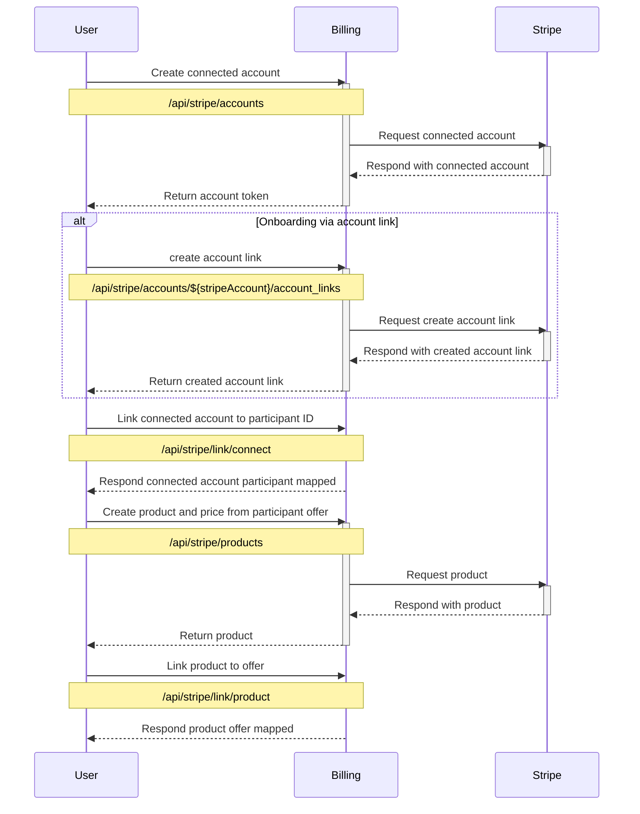
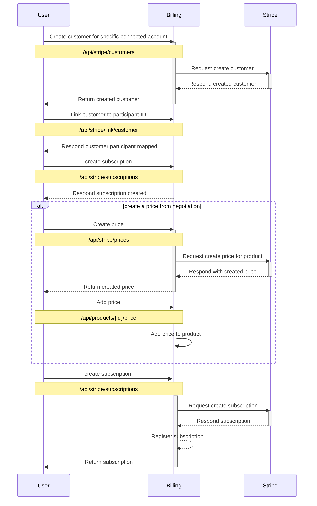
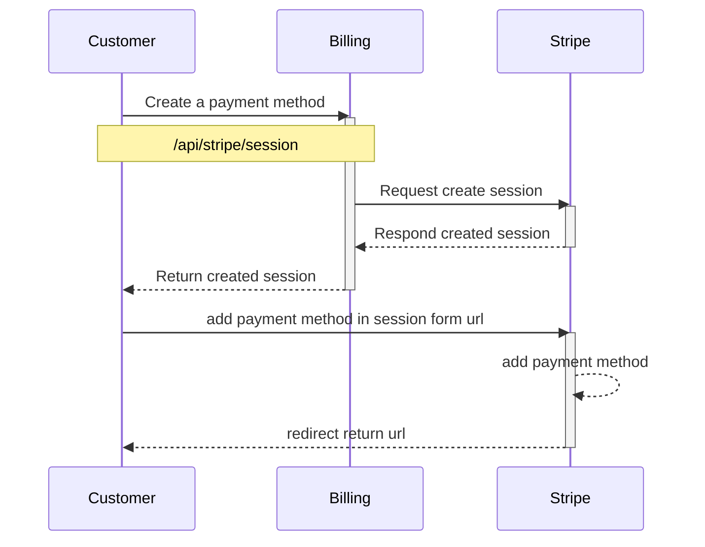
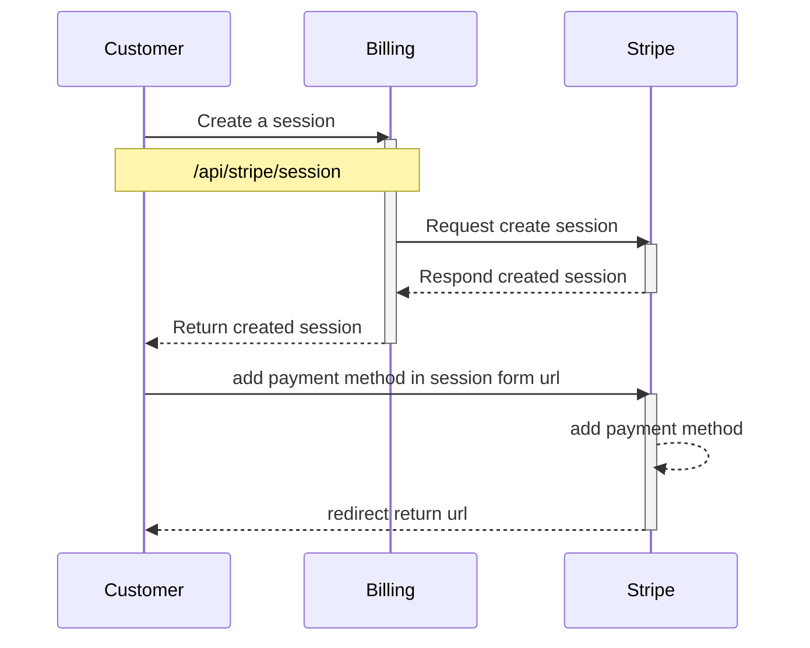
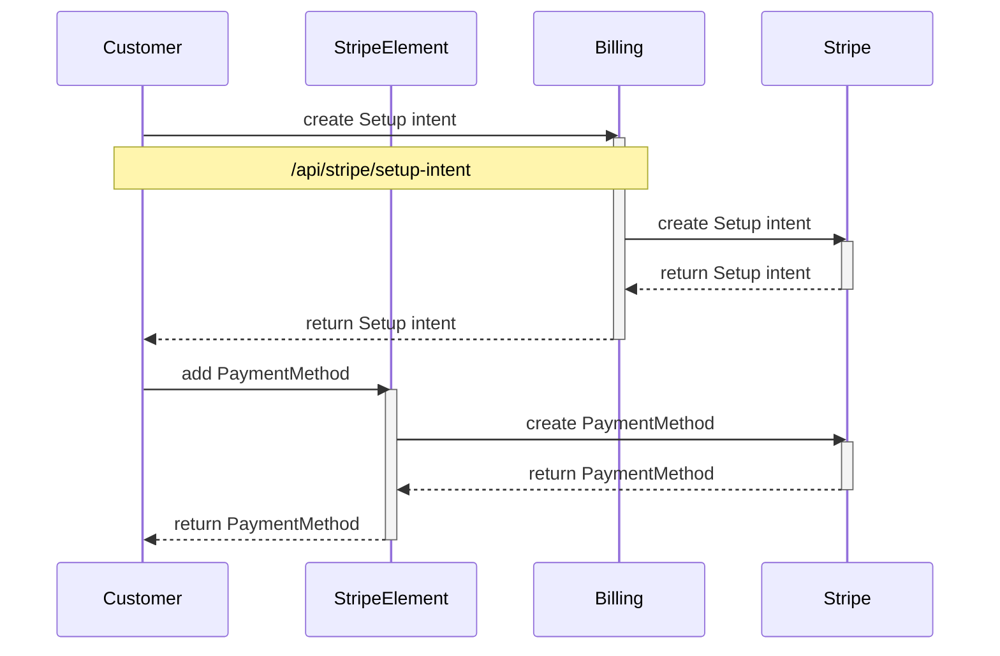
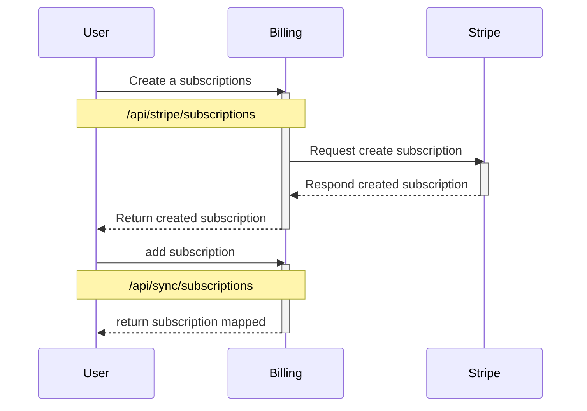

# Functional Flow

## Setup participant express connected account and offers

```mermaid
sequenceDiagram
    participant User
    participant Billing
    participant Stripe

    %% User creates a connected account on billing
    User->>Billing: Create connected account
    activate Billing
    Note over User, Billing: /api/stripe/accounts
    Billing->>Stripe: Request connected account
    activate Stripe
    Stripe-->>Billing: Respond with connected account
    deactivate Stripe
    Billing-->>User: Return account token
    deactivate Billing

    %% Optional: User generate an account link to proceed to onboarding
    alt Onboarding via account link
        User->>Billing: create account link
        activate Billing
        Note over User, Billing: /api/stripe/accounts/${stripeAccount}/account_links
        Billing->>Stripe: Request create account link
        activate Stripe
        Stripe-->>Billing: Respond with created account link
        deactivate Stripe
        Billing-->>User: Return created account link
        deactivate Billing
    end

    %% User links the connected account to participant ID
    User->>Billing: Link connected account to participant ID
    Note over User, Billing: /api/stripe/link/connect
    Billing-->>User: Respond connected account participant mapped

    %% User creates product and price from participant offer
    User->>Billing: Create product and price from participant offer
    activate Billing
    Note over User, Billing: /api/stripe/products
    Billing->>Stripe: Request product
    activate Stripe
    Stripe-->>Billing: Respond with product
    deactivate Stripe
    Billing-->>User: Return product
    deactivate Billing

    %% User links the product to the offer
    User->>Billing: Link product to offer
    Note over User, Billing: /api/stripe/link/product
    Billing-->>User: Respond product offer mapped
```

## Setup contract signing

```mermaid
sequenceDiagram
    participant User
    participant Billing
    participant Stripe

    User->>Billing: Create customer for specific connected account
    activate Billing
    Note over User, Billing: /api/stripe/customers
    Billing->>Stripe: Request create customer
    activate Stripe
    Stripe-->>Billing: Respond created customer
    deactivate Stripe
    Billing-->>User: Return created customer
    deactivate Billing
    
    %% User links the customer to participant ID
    User->>Billing: Link customer to participant ID
    Note over User, Billing: /api/stripe/link/customer
    Billing-->>User: Respond customer participant mapped
    
    %% User links the customer to participant ID
    User->>Billing: create subscription
    Note over User, Billing: /api/stripe/subscriptions
    Billing-->>User: Respond subscription created

    %% Optional: User update an connected account
    alt create a price from negotiation
        User->>Billing: Create price
        activate Billing
        Note over User, Billing: /api/stripe/prices
        Billing->>Stripe: Request create price for product
        activate Stripe
        Stripe-->>Billing: Respond with created price
        deactivate Stripe
        Billing-->>User: Return created price
        deactivate Billing
        User->>Billing: Add price
        activate Billing
        Note over User, Billing: /api/products/{id}/price
        Billing->>Billing: Add price to product
    end
    
    %% User links the customer to participant ID
    User->>Billing: create subscription
    Note over User, Billing: /api/stripe/subscriptions
    activate Billing
    Billing->>Stripe: Request create subscription
    activate Stripe
    Stripe-->>Billing: Respond subscription
    deactivate Stripe
    Billing-->>Billing: Register subscription
    Billing-->>User: Return subscription
    deactivate Billing
```

## adding payment method

### API

```mermaid
sequenceDiagram
    participant Customer
    participant Billing
    participant Stripe

    Customer->>Billing: Create a payment method
    activate Billing
    Note over Customer, Billing: /api/stripe/session
    Billing->>Stripe: Request create session
    activate Stripe
    Stripe-->>Billing: Respond created session
    deactivate Stripe
    Billing-->>Customer: Return created session
    deactivate Billing

    Customer->>Stripe: add payment method in session form url
    activate Stripe
    Stripe-->>Stripe: add payment method
    Stripe-->>Customer: redirect return url
    deactivate Stripe
```

### Session

```mermaid
sequenceDiagram
    participant Customer
    participant Billing
    participant Stripe

    Customer->>Billing: Create a session
    activate Billing
    Note over Customer, Billing: /api/stripe/session
    Billing->>Stripe: Request create session
    activate Stripe
    Stripe-->>Billing: Respond created session
    deactivate Stripe
    Billing-->>Customer: Return created session
    deactivate Billing

    Customer->>Stripe: add payment method in session form url
    activate Stripe
    Stripe-->>Stripe: add payment method
    Stripe-->>Customer: redirect return url
    deactivate Stripe
```

### Stripe component

```mermaid
sequenceDiagram
    participant Customer
    participant StripeElement
    participant Billing
    participant Stripe

    Customer->>Billing: create Setup intent
    activate Billing
    Note over Customer, Billing: /api/stripe/setup-intent
    Billing->>Stripe: create Setup intent
    activate Stripe
    Stripe-->>Billing: return Setup intent
    deactivate Stripe
    Billing-->>Customer: return Setup intent
    deactivate Billing

    Customer->>StripeElement: add PaymentMethod
    activate StripeElement
    StripeElement->>Stripe: create PaymentMethod
    activate Stripe
    Stripe-->>StripeElement: return PaymentMethod
    deactivate Stripe
    StripeElement-->>Customer: return PaymentMethod
    deactivate StripeElement

```

## Subscription

```mermaid
sequenceDiagram
    participant User
    participant Billing
    participant Stripe

    User->>Billing: Create a subscriptions
    activate Billing
    Note over User, Billing: /api/stripe/subscriptions
    Billing->>Stripe: Request create subscription
    activate Stripe
    Stripe-->>Billing: Respond created subscription
    deactivate Stripe
    Billing-->>User: Return created subscription
    deactivate Billing

    User->>Billing: add subscription
    activate Billing
    Note over User, Billing: /api/sync/subscriptions
    Billing-->>User: return subscription mapped
    deactivate Billing
```