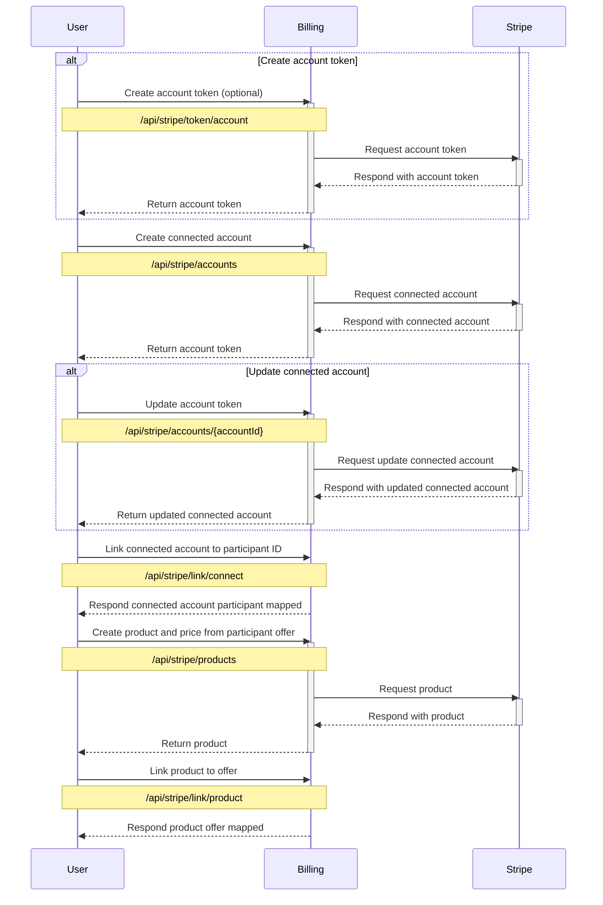
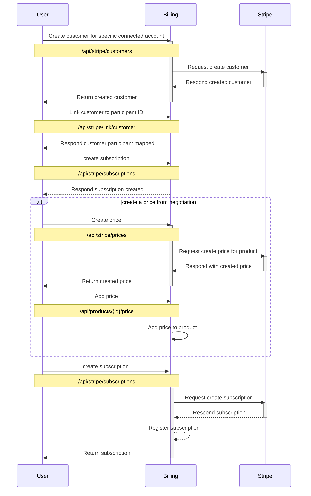
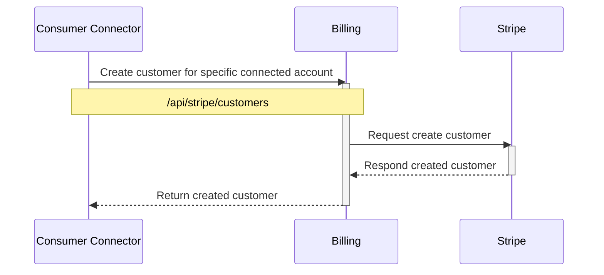

# Functional Flow
## Setup participant connected account and offers

```mermaid
sequenceDiagram
    participant User
    participant Billing
    participant Stripe

    %% Optional: User creates an account token on billing
    alt Create account token
        User->>Billing: Create account token (optional)
        activate Billing
        Note over User, Billing: /api/stripe/token/account
        Billing->>Stripe: Request account token
        activate Stripe
        Stripe-->>Billing: Respond with account token
        deactivate Stripe
        Billing-->>User: Return account token
        deactivate Billing
    end 

    %% User creates a connected account on billing
    User->>Billing: Create connected account
    activate Billing
    Note over User, Billing: /api/stripe/accounts
    Billing->>Stripe: Request connected account
    activate Stripe
    Stripe-->>Billing: Respond with connected account
    deactivate Stripe
    Billing-->>User: Return account token
    deactivate Billing

    %% Optional: User update an connected account
    alt Update connected account
        User->>Billing: Update account token
        activate Billing
        Note over User, Billing: /api/stripe/accounts/{accountId}
        Billing->>Stripe: Request update connected account
        activate Stripe
        Stripe-->>Billing: Respond with updated connected account
        deactivate Stripe
        Billing-->>User: Return updated connected account
        deactivate Billing
    end

    %% User links the connected account to participant ID
    User->>Billing: Link connected account to participant ID
    Note over User, Billing: /api/stripe/link/connect
    Billing-->>User: Respond connected account participant mapped

    %% User creates product and price from participant offer
    User->>Billing: Create product and price from participant offer
    activate Billing
    Note over User, Billing: /api/stripe/products
    Billing->>Stripe: Request product
    activate Stripe
    Stripe-->>Billing: Respond with product
    deactivate Stripe
    Billing-->>User: Return product
    deactivate Billing

    %% User links the product to the offer
    User->>Billing: Link product to offer
    Note over User, Billing: /api/stripe/link/product
    Billing-->>User: Respond product offer mapped
```

## Setup contract signing

```mermaid
sequenceDiagram
    participant User
    participant Billing
    participant Stripe

    User->>Billing: Create customer for specific connected account
    activate Billing
    Note over User, Billing: /api/stripe/customers
    Billing->>Stripe: Request create customer
    activate Stripe
    Stripe-->>Billing: Respond created customer
    deactivate Stripe
    Billing-->>User: Return created customer
    deactivate Billing
    
    %% User links the customer to participant ID
    User->>Billing: Link customer to participant ID
    Note over User, Billing: /api/stripe/link/customer
    Billing-->>User: Respond customer participant mapped
    
    %% User links the customer to participant ID
    User->>Billing: create subscription
    Note over User, Billing: /api/stripe/subscriptions
    Billing-->>User: Respond subscription created

    %% Optional: User update an connected account
    alt create a price from negotiation
        User->>Billing: Create price
        activate Billing
        Note over User, Billing: /api/stripe/prices
        Billing->>Stripe: Request create price for product
        activate Stripe
        Stripe-->>Billing: Respond with created price
        deactivate Stripe
        Billing-->>User: Return created price
        deactivate Billing
        User->>Billing: Add price
        activate Billing
        Note over User, Billing: /api/products/{id}/price
        Billing->>Billing: Add price to product
    end
    
    %% User links the customer to participant ID
    User->>Billing: create subscription
    Note over User, Billing: /api/stripe/subscriptions
    activate Billing
    Billing->>Stripe: Request create subscription
    activate Stripe
    Stripe-->>Billing: Respond subscription
    deactivate Stripe
    Billing-->>Billing: Register subscription
    Billing-->>User: Return subscription
    deactivate Billing
```

## Exchange

```mermaid
sequenceDiagram
    participant Consumer Connector
    participant Billing
    participant Stripe

    Consumer Connector->>Billing: Create customer for specific connected account
    activate Billing
    Note over Consumer Connector, Billing: /api/stripe/customers
    Billing->>Stripe: Request create customer
    activate Stripe
    Stripe-->>Billing: Respond created customer
    deactivate Stripe
    Billing-->>Consumer Connector: Return created customer
    deactivate Billing
```